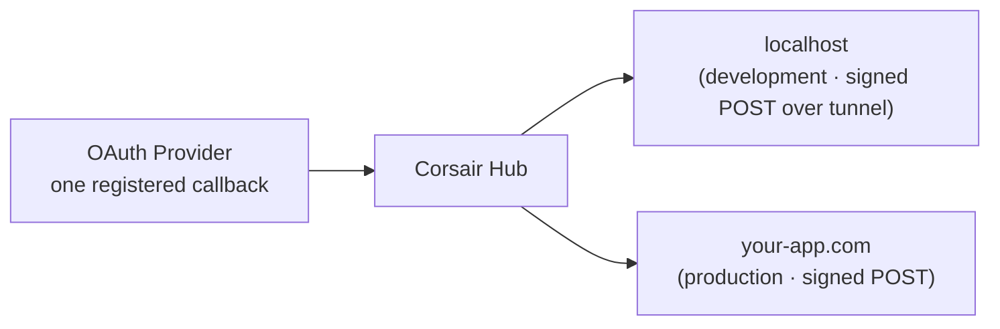

Without Hub, the OAuth redirect URI you register with a provider has to match the environment handling the callback. Local, staging, and production each need their own redirect URI, which means either separate provider apps or rewriting the registered URI every time you switch environments.

With Hub you register **one** callback URL with the provider, `https://auth.corsair.dev/oauth/callback`. Hub receives the callback and delivers the result to your app as a signed server POST. In both [environments](/hub/environments) the wire contract is the same: development reaches your local app through a Corsair-provided tunnel, production reaches your public URL directly. See [Why delivery works differently](/hub/environments#why-delivery-works-differently) for the full picture.



## Mount your handler

Your app exposes the delivery endpoint through the mounted Corsair handler. `toNextJsHandler` serves Hub delivery at the base path automatically:

```ts app/api/corsair/[[...path]]/route.ts
import { toNextJsHandler } from "corsair";
import { corsair } from "@/server";

export const { GET, POST, OPTIONS } = toNextJsHandler(corsair, {
    basePath: "/api/corsair",
});
```

You do **not** put the delivery URL in your `hub` config. It is resolved per environment (see below).

## Development delivery

When your app uses a **development** API key (`ck_dev_…`), the SDK opens a Corsair-provided tunnel so Hub can reach your local app with the same signed POST it uses in production:

```bash .env.local
CORSAIR_API_KEY=ck_dev_...
CORSAIR_SIGNING_SECRET=...
# Optional override for the local mount path:
CORSAIR_DELIVERY_URL=http://localhost:3001/api/corsair
```

On startup the SDK asks Hub for the tunnel connection details, then opens the tunnel. The `ck_dev_` key is the credential: the tunnel server validates it live on connect, and Hub vends a Corsair-owned public URL (`https://<slug>.corsair.run/api/corsair`) scoped to your app's delivery path. No account, ngrok, or manual URL is needed. `CORSAIR_DELIVERY_URL` only sets which local path your app serves.

Hub delivers signed JSON envelopes to that tunnel URL, the same signed-POST contract as production (see below); your handler verifies each one. No dashboard registration is required for development. While the tunnel is live the dashboard's **App sync** indicator turns green.

<Info>
An older browser-redirect fallback (Hub redirects the user's browser to `localhost` with a `?d=…` payload) still runs for a dev app started without a tunnel, but it is legacy and being phased out in favor of the tunnel path. New apps should rely on the tunnel.
</Info>

## Production delivery

When your app uses a **production** API key (`ck_prod_…`), Hub POSTs a **signed JSON envelope** to the delivery URL registered in the [Hub dashboard](/hub/dashboard) (**Delivery URLs** tab, then Activate production).

```bash
CORSAIR_API_KEY=ck_prod_...
CORSAIR_SIGNING_SECRET=...
```

The URL must be a public HTTPS endpoint (not localhost). Hub signs each POST with your `signingSecret`; your handler verifies the signature before accepting it.

Register or update the URL in the dashboard before deploying. Production connect flows fail until production is activated.

## The signing secret

Each delivered payload is signed with your environment's `signingSecret`. Your handler verifies the signature before accepting it, so only payloads from Hub for your project are applied. Keep the signing secret in server-side environment variables, never in client code.

<Info>
Delivery URLs change *where the result is routed*. They do not change where credentials are stored. The delivered tokens are encrypted and persisted in your database. See [Where your credentials live](/hub/overview#where-your-credentials-live).
</Info>

## What's next

<CardGroup cols={2}>
  <Card title="Environments" href="/hub/environments">
    Development vs production keys and when to use each.
  </Card>
  <Card title="Hub dashboard" href="/hub/dashboard">
    Activate production and manage delivery URLs.
  </Card>
  <Card title="Connect / OAuth" href="/management/connect">
    The createLink API.
  </Card>
</CardGroup>
